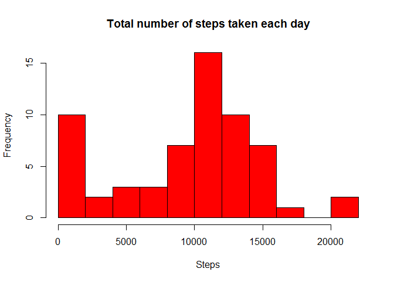

# Reproducible Research: Peer Assessment 1


## Loading and preprocessing the data
<br/>
**1. Load the data**

This assignment makes use of data from a personal activity monitoring device (such as a Fitbit, Nike Fuelband, or Jawbone Up). This device collects data at 5 minute intervals through out the day. The data consists of two months of data from an anonymous individual collected during the months of October and November, 2012 and include the number of steps taken in 5 minute intervals each day.

<br/>
The data can be downloaded from the course web site:

Dataset: [Activity Monitoring Data[52K]](https://d396qusza40orc.cloudfront.net/repdata%2Fdata%2Factivity.zip)

(Assumption: 'activity.zip' that contains the dataset 'activity.csv' is downloaded and placed in the same folder as 'PA1_template.Rmd')


```r
amd <- read.csv(unz('./activity.zip', 'activity.csv'))
```

<br/>
The dataset contains the following columns:

```r
names(amd)
```

```
## [1] "steps"    "date"     "interval"
```

- steps: Number of steps taking in a 5-minute interval (missing values are coded as NA)
- date: The date on which the measurement was taken in YYYY-MM-DD format
- interval: Identifier for the 5-minute interval in which measurement was taken

<br/>
Let's look at the first few rows of the dataset:

```r
head(amd)
```

```
##   steps       date interval
## 1    NA 2012-10-01        0
## 2    NA 2012-10-01        5
## 3    NA 2012-10-01       10
## 4    NA 2012-10-01       15
## 5    NA 2012-10-01       20
## 6    NA 2012-10-01       25
```
<br/>

## What is mean total number of steps taken per day?
<br/>

**1. Calculate the total number of steps taken per day**

dplyr library package is quite helpful to group and summarize the data. Lets load it into our workspace.
Group the data by date and get the sum, mean and median steps per group.

```r
library(dplyr)
```

```
## 
## Attaching package: 'dplyr'
```

```
## The following objects are masked from 'package:stats':
## 
##     filter, lag
```

```
## The following objects are masked from 'package:base':
## 
##     intersect, setdiff, setequal, union
```

```r
sumByDate <- amd %>% group_by(date) %>% summarize(totalSteps = sum(steps, na.rm = TRUE), 
                                                   mean = mean(steps, na.rm=TRUE), 
                                                   median = median(steps, na.rm=TRUE))
```

<br/>

**2. Make a histogram of the total number of steps taken each day**

```r
hist(sumByDate$totalSteps, breaks=10, main='Total number of steps taken each day', xlab='Steps', col='red')
```

<!-- -->

<br/>

**3. Calculate and report the mean and median of the total number of steps taken per day**

Mean is 9354 steps/day and Median is 10395 steps/day

<br/>

## What is the average daily activity pattern?

<br/>
**1. Make a time series plot (i.e. type = "l") of the 5-minute interval (x-axis) and the average number of steps taken, averaged across all days (y-axis)**

Group the data by interval and get average steps taken across all days. Plot the time series of average steps by interval.

```r
avgStepsByInterval <- amd %>% group_by(interval) %>% summarize(avgSteps = mean(steps, na.rm=TRUE))
with(avgStepsByInterval, plot(interval, avgSteps, type='l', col='red'))
```

<!-- -->

<br/>
**2. Which 5-minute interval, on average across all the days in the dataset, contains the maximum number of steps?**

```r
avgStepsByInterval[which.max(avgStepsByInterval$avgSteps),]
```

```
## Source: local data frame [1 x 2]
## 
##   interval avgSteps
##      (int)    (dbl)
## 1      835 206.1698
```
Maximum number of steps is in the afternoon around 2PM.

<br/>

## Imputing missing values

<br/>
**1. Calculate and report the total number of missing values in the dataset (i.e. the total number of rows with NAs)**

Total number of missing values in the dataset is 2304

<br/>
**2. Devise a strategy for filling in all of the missing values in the dataset.**
**3. Create a new dataset that is equal to the original dataset but with the missing data filled in.**
Let's replace the NAs with the average steps for that 5 minute interval across all days taken by the individual. We will use dplyr package to perform the group by interval and replace any missing steps. Create a new dataset with the NA values filled in.

```r
amdWithoutNAs <- amd %>% group_by(interval) %>% mutate(steps = replace(steps, is.na(steps), as.integer(mean(steps, na.rm=TRUE))))
```

<br/>
**4. Make a histogram of the total number of steps taken each day and Calculate and report the mean and median total number of steps taken per day.**
Group by the new dataset by date and calculate sum, mean and median of steps taken individual per day.

```r
sumByDateWithoutNAs <- amdWithoutNAs %>% group_by(date) %>% summarize(totalSteps = sum(steps, na.rm = TRUE),
                                                                      mean = mean(steps, na.rm=TRUE),
                                                                      median = median(steps, na.rm=TRUE))
hist(sumByDateWithoutNAs$totalSteps, breaks=10, main='Total number of steps taken each day', xlab='Steps', col='red')
```

<!-- -->

Recalculating with NAs filled in, Mean is 10749 steps/day and Median is 10641 steps/day.

Replacing the NAs in the original dataset with the mean for the 5 minute interval (across all days), has shifted the new dataset mean and median steps per day slightly higher. As the number of rows with NAs is much lower compared to the rows with valid values, filling in with average values provided a moderate rise. 
<br/>

## Are there differences in activity patterns between weekdays and weekends?

<br/>
**1. Create a new factor variable in the dataset with two levels - "weekday" and "weekend" indicating whether a given date is a weekday or weekend day.**

Add a new factor variable daytype to the dataset. Factor will contain values 'Weekend' and 'Weekday'

```r
amdWithoutNAs$daytype <-  ifelse(weekdays(as.Date(amdWithoutNAs$date)) %in% c('Sunday', 'Saturday'), 'Weekend', 'Weekday')
```

**2. Make a panel plot containing a time series plot (i.e. type = "l") of the 5-minute interval (x-axis) and the average number of steps taken, averaged across all weekday days or weekend days (y-axis).**

Using dplyr functions, filter by weekend/weekday, group_by interval and plot the timeseries


```r
par(mfrow=c(2,1))
par(mar=c(4,4,1,0))

avgStepsByWeekendandInterval <- amdWithoutNAs %>% filter(daytype == 'Weekend') %>% group_by(interval) %>% summarize(avgSteps = mean(steps, na.rm=TRUE))
avgStepsByWeekdayandInterval <- amdWithoutNAs %>% filter(daytype == 'Weekday') %>% group_by(interval) %>% summarize(avgSteps = mean(steps, na.rm=TRUE))

with(avgStepsByWeekendandInterval, plot(interval , avgSteps, type='l', main='Weekend', col='red', xlab=''))
with(avgStepsByWeekdayandInterval, plot(interval, avgSteps, type='l', main='Weekday', col='blue', xlab='interval'))
```

<!-- -->

The plots show weekdays and weekends zero to very low activity early in the morning. On weekends and weekdays, there is comparable and high average steps in the morning potentially getting to work or getting to weekend activities. On weekdays the average steps seem to drop off in the afternoon hours potentially as a result desk/idle job activity. However, the individual seems more active in the afternoon hours during the weekends.
